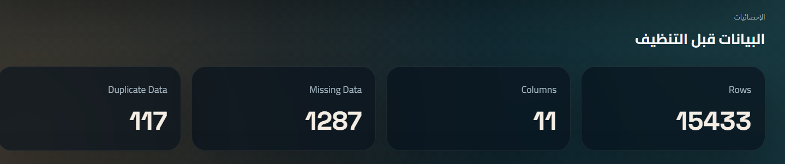
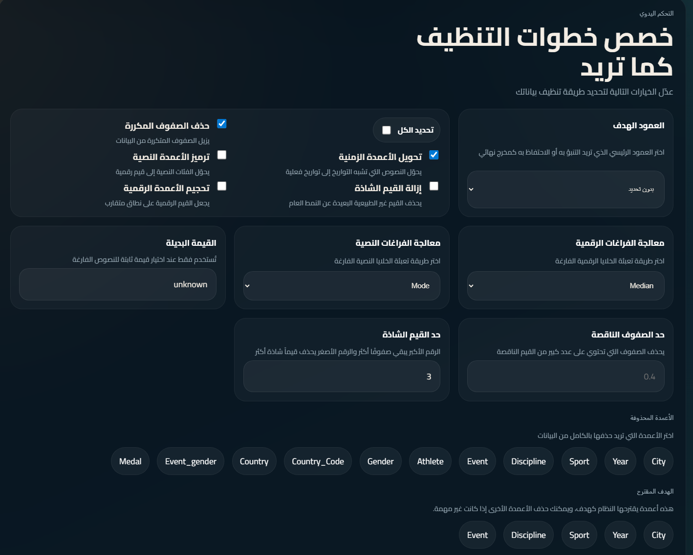

# ROUTE AI - Smart Data Cleaner 🚀

**ROUTE AI** is a comprehensive, intelligent platform designed for automated data cleaning, analysis, and preparation. It transforms "dirty" raw datasets into clean, analysis-ready data for machine learning and business intelligence, saving hours of tedious manual labor.

---

## 📸 Platform Overview (Preview)

### 1. Landing Page
A modern, dark-mode interface designed to provide a professional and seamless user experience.

### 2. Dashboard & File Upload
Full support for CSV and Excel files with drag-and-drop functionality, highlighting core features like auto-analysis and smart cleansing.

### 3. Cleaning Mode Selection
Users can choose between **Full Auto-Clean**, powered by system algorithms, or **Manual Mode** for granular control.

### 4. Preprocessing Statistics
Real-time display of dataset health, including row/column counts, duplicates, and missing data detection (e.g., detecting 1200+ missing values instantly).

### 5. Advanced Manual Cleaning
A detailed interface for professional data handling:
- **Missing Data:** Impute using Mean, Median, or Mode.
- **Outliers:** Detect and remove anomalous data points.
- **Encoding:** Handle categorical text and numerical scaling.
- **Target Selection:** Define target columns and drop unnecessary features.

### 6. Save Presets & Row Filtering
Unique feature to save manual configurations as presets for future use, alongside custom conditional filtering for rows.

### 7. Final Preview & Results
Side-by-side comparison of data before and after cleaning, showing a successful 0% missing/duplicate rate.

---

## ✨ Key Features
- **Smart Cleansing:** Intelligent algorithms for automated data type detection and treatment.
- **Save Presets:** Save your manual workflow and apply it to other files with one click.
- **Real-time Analytics:** Instant insights into data structure and quality.
- **One-Click Execution:** Fully automated deployment using PowerShell scripts.

---

